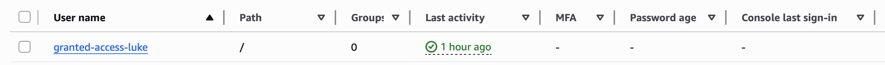
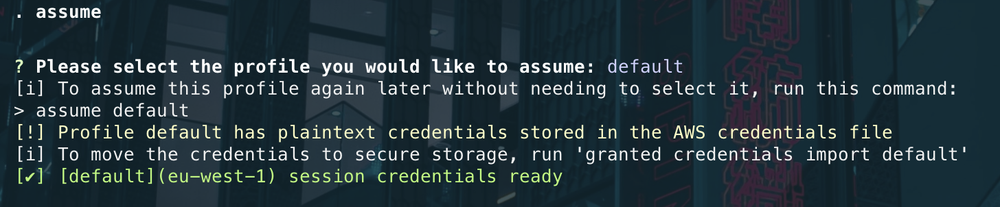
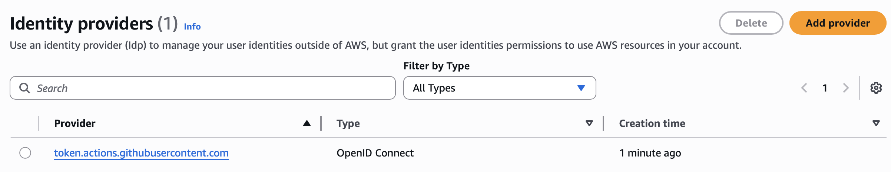

<file name=0 path=/Users/luke/Desktop/Surf/aws-access-management/README.md><!-- GitHub Actions Status Badge -->


# Secure AWS Access Management with Granted + GitHub OIDC

This guide walks through setting up a **secure, role-based AWS access system** using two key components:

1. **Granted** – for secure, short-lived access via IAM roles
2. **GitHub Actions + OIDC** – for CI/CD deployments with no stored credentials

---

## 📦 Prerequisites

Before starting, make sure you have the following installed:

### 🧰 CLI Tools

* **[Terraform](https://developer.hashicorp.com/terraform/downloads)**

  ```bash
  brew tap hashicorp/tap
  brew install hashicorp/tap/terraform
  ```

* **[Granted](https://docs.commonfate.io/granted/getting-started/)**

  ```bash
  brew install common-fate/granted/granted
  granted doctor  # Verify installation
  ```

* **AWS CLI**

  ```bash
  brew install awscli
  ```

These tools are used throughout the setup and should be available in your `$PATH`.

---

## 📁 Project Structure

```
.
├── README.md  👈 this file
├── assets/                   # Screenshots
├── granted/
│   ├── terraform/            # Terraform for user IAM role
├── oidc-ci/
│   ├── terraform/            # Terraform for GitHub OIDC role
│   ├── deploy/               # Terraform for GitHub workflow deployment
└── .github/workflows/
    └── deploy.yml            # GitHub Actions CI/CD workflow
```

---

## ✅ Overview of Steps

| Stage             | What You Do                                                                 |
| ----------------- | --------------------------------------------------------------------------- |
| 🧱 Bootstrap      | Create an IAM user with Admin access to deploy initial roles                |
| 🏗️ Granted Setup | Use Terraform to create a role for local dev access via `assume`            |
| 🔐 Permissions Tapering | Reduce permissions             |
| 🚀 OIDC Setup     | Use Terraform to create a GitHub-deployable IAM role via OIDC               |
| ⚙️ CI/CD          | Add a GitHub Actions workflow using `configure-aws-credentials` + Terraform |

---

## 🧱 1. Bootstrap IAM Setup (One-Time Manual Step)

> 👇 This step is temporary and should **NOT** remain long-term. It's only needed to deploy the first IAM role.

1. **Login as the AWS root user or a user with sufficient permissions**
2. Create an IAM user:

   * Name: `granted-user`
   * Permissions: `AdministratorAccess`
   * Access type: Programmatic access



3. Run locally:

```bash
aws configure --profile granted-user
```

---

## 🛠️ 2. Deploy Granted Role via Terraform

```bash
cd granted/terraform
```

### 🔐 secrets.tfvars (Not committed)

```hcl
account_id = "123456789012"
granted_iam_user = "granted-user"
```

### ✅ Run

```bash
terraform init
terraform apply -var-file="secrets.tfvars"
```

This creates:

* A new IAM role: `granted-admin-role`
* A trust policy allowing assumption by your IAM user

### ✅ Use Granted to Assume Role

```bash
assume <name of role>
```



---

## 🔐 3. Harden Account

Once Granted works:

* Remove the IAM user's `AdministratorAccess`
* Restrict it to only `sts:AssumeRole` to the granted role

Now the granted role can be used for further terraform deployments.

---

## ☁️ 4. Set Up OIDC IAM Role for GitHub

Once you've assumed the `granted-admin-role` using Granted:

```bash
assume <name of role>
```

Navigate to the OIDC Terraform directory:

### 🔐 secrets.tfvars (Not committed)

```hcl
aws_account_id = "123456789012"
github_repo    = "github-user/repo-name"
```
Then run:

```bash
terraform init
terraform apply -var-file="secrets.tfvars"
```

This will:

* Deploy the **GitHub OIDC provider** (if not already present)
* Create the `github-deploy-role` with trust configuration for GitHub Actions

> 💡 You’ll see a confirmation of the role and trust policy being created in your terminal output




---

## 🤖 5. GitHub Actions Workflow: `deploy.yml`

> 🛠️ **Want to auto-deploy on every push?**  
> To enable Terraform deployment on every push to `main`, simply change the section of the workflow file:
>
> ```yaml
>   deploy-terraform:
>     if: github.event_name == 'workflow_dispatch'
>     runs-on: ubuntu-latest
> ```
> to:
>
> ```yaml
>   deploy-terraform:
>     if: github.event_name == 'push'
>     runs-on: ubuntu-latest
> ```
>
> This will cause the deployment job to run every time changes are pushed to the `main` branch.
</file>


Once the `github-deploy-role` is deployed, simply **push your repo to GitHub** to trigger the OIDC-based workflow.

✅ Just ensure that your GitHub repository has the following secret configured:

* `AWS_ACCOUNT_ID` → Your actual AWS account ID (e.g., `123456789012`)

The workflow file already exists at:

```
.github/workflows/deploy.yml
```

It will:

* Authenticate to AWS using OIDC
* Run `terraform init`, `plan`, and `apply` on the OIDC role configuration

> 💡 You can monitor the run in the GitHub Actions tab after pushing to `main`.
